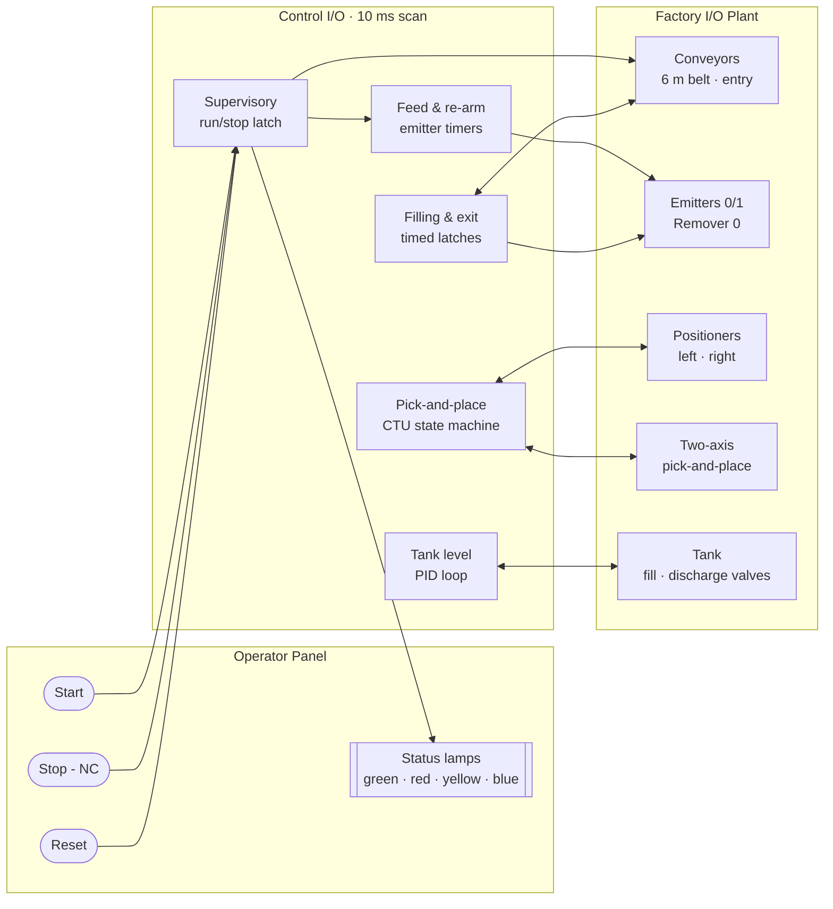
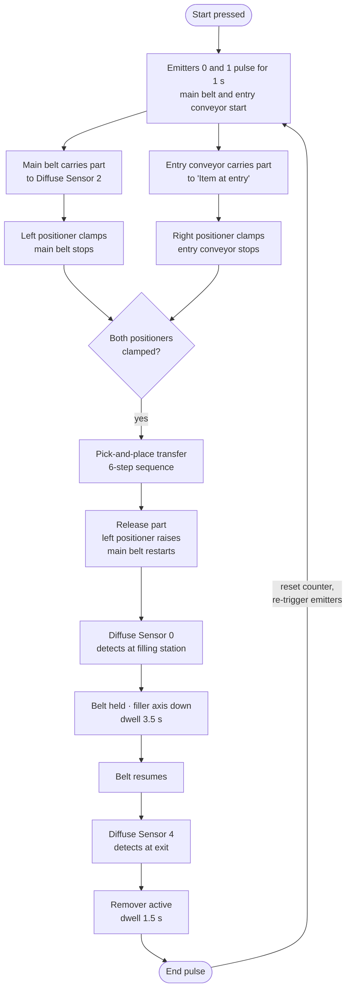
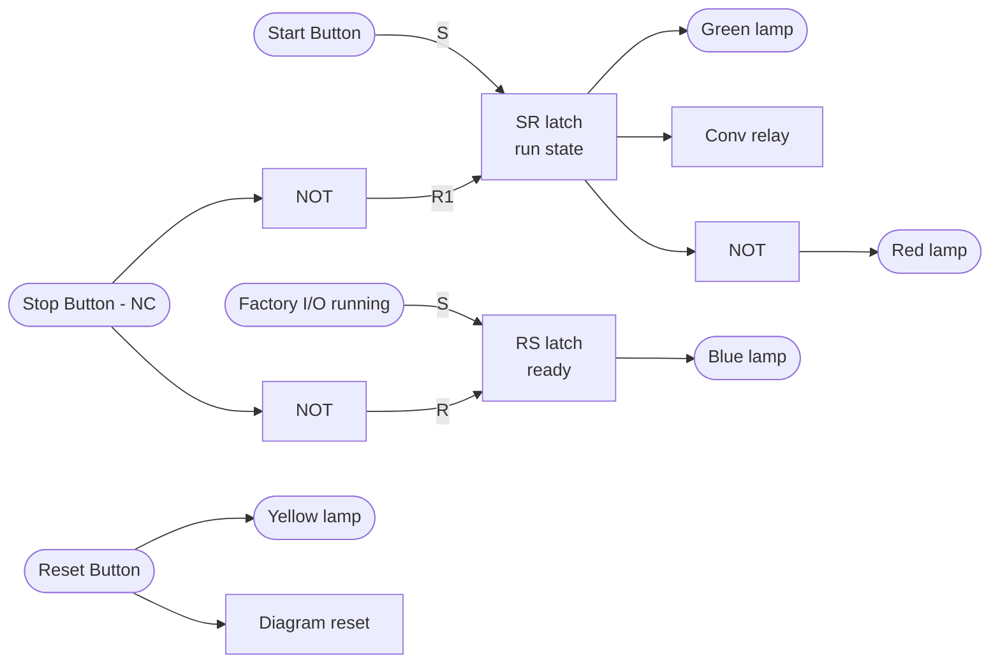
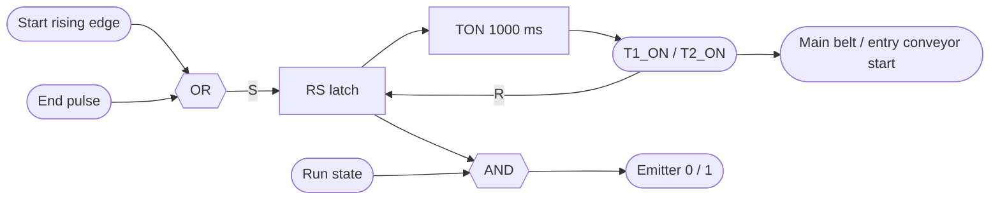
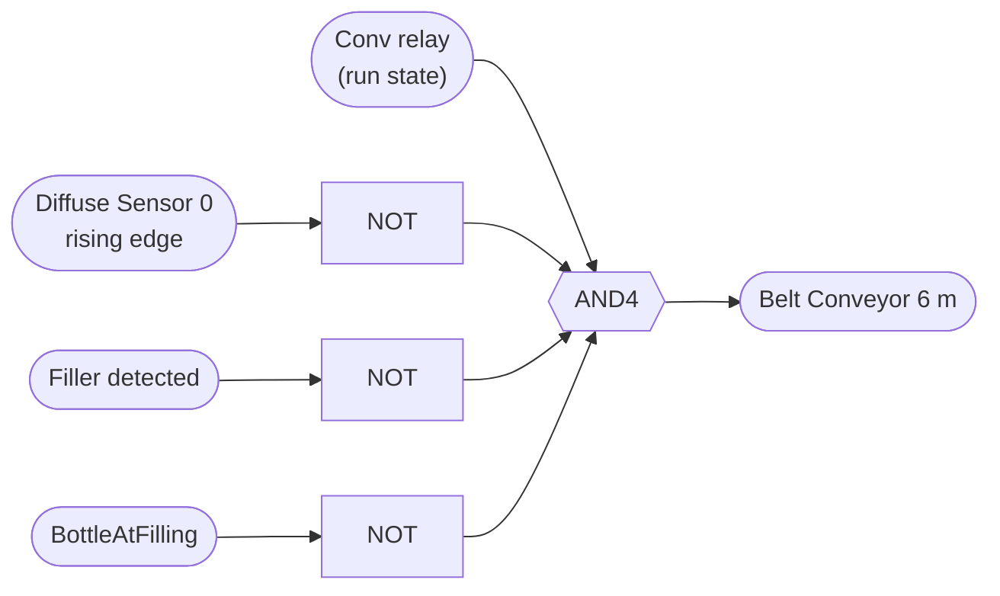
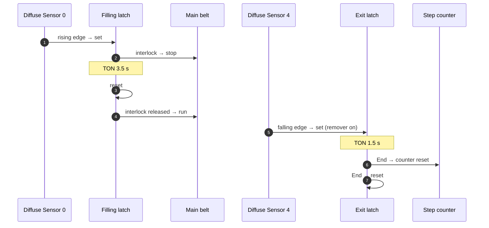
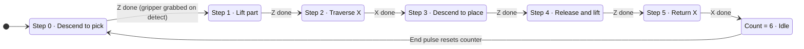
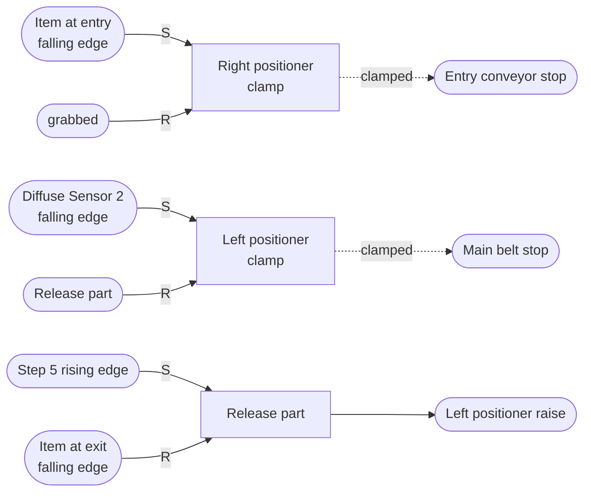
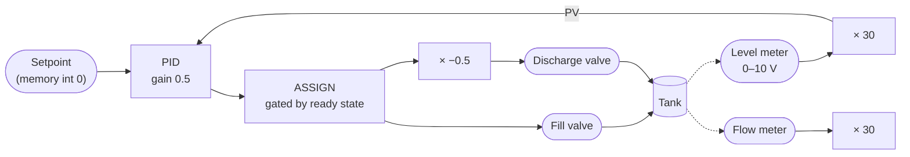

<div align="center">

# Automated Water Bottling Line

**A simulated bottling cell with sequenced material handling, two-axis pick-and-place transfer, timed filling, and closed-loop tank level control.**


[**Overview**](#overview) &nbsp;·&nbsp;
[**Architecture**](#system-architecture) &nbsp;·&nbsp;
[**Process Flow**](#process-flow) &nbsp;·&nbsp;
[**Control Logic**](#control-logic) &nbsp;·&nbsp;
[**Pick-and-Place**](#pick-and-place-state-machine) &nbsp;·&nbsp;
[**Tank Control**](#tank-level-control) &nbsp;·&nbsp;
[**I/O Map**](#io-map) &nbsp;·&nbsp;
[**Run It**](#running-the-simulation) &nbsp;·&nbsp;
[**Future Work**](#limitations-and-future-work)

</div>

---

## Overview

This project models a complete bottling cell in **Factory I/O** and controls it with a function-block program written in **Control I/O**. Two independent part streams are fed into the cell, merged by a two-axis pick-and-place unit, filled at a timed station, and removed at the exit, after which the controller re-arms itself for the next cycle.

The emphasis is on **deterministic sequencing from discrete sensor events**: every motion is triggered by an edge on a sensor or a motion-complete signal, and the transfer sequence is encoded as a counter-indexed state machine rather than a chain of ad-hoc latches.

> 🎥 **Demo:** [`water_bottling_demo.mp4`](water_bottling_demo.mp4) — a 40 s recording of a full production cycle.

### At a glance

| | |
|---|---|
| **Plant** | 6 m belt conveyor, entry conveyor, 2 emitters, remover, 2 positioners, two-axis pick-and-place, tank with fill/discharge valves |
| **Sensing** | 3 diffuse photoelectric sensors, positioner clamp feedback, gripper part detection, axis motion status, tank level and flow meters |
| **Controller** | 69 function blocks · 23 DI · 20 DO · 2 AI · 2 AO · 10 ms scan, synchronous reset |
| **Operator panel** | Start, Stop, Reset push-buttons · green/red/yellow/blue status lamps |

---

## System Architecture

The controller sits between the operator panel and four plant subsystems. All signals pass through the Factory I/O ↔ Control I/O driver.



---

## Process Flow

The cell processes **two part streams** in parallel. Emitter 0 feeds the main belt; Emitter 1 feeds the entry conveyor. The pick-and-place unit transfers the part held at the right positioner onto the part held at the left positioner, then releases the line toward filling and exit.



---

## Control Logic

The program is organized into five functional groups. Block usage across the diagram:

| Block | Count | Role in the program |
|---|---:|---|
| `RS` / `SR` | 15 / 1 | Step and actuator latches; set-dominant run/stop latch |
| `R_TRIG` / `F_TRIG` | 7 / 6 | Convert sensor levels and motion-complete signals into single-scan events |
| `AND` / `OR` / `NOT` | 6 / 7 / 9 | Transition conditions and interlocks |
| `EQ` | 8 | Decode the active step from the sequence counter |
| `TON` | 4 | Emitter pulses (2 × 1 s), fill dwell (3.5 s), exit dwell (1.5 s) |
| `CTU` | 1 | Pick-and-place step counter (preset 6) |
| `MUL` | 3 | Analog scaling of level, flow, and discharge command |
| `PID` · `ASSIGN` | 1 · 1 | Tank level regulation and output gating |

### 1. Supervisory control

A set-dominant `SR` latch holds the run state. **Start** sets it; the normally-closed **Stop** button, inverted through `NOT`, resets it. The latch drives the green lamp and the conveyor relay, and its complement drives the red lamp. **Reset** lights the yellow lamp and triggers a diagram-wide reset of every latch, timer, and counter.



### 2. Feed and re-arm

Each emitter has its own one-shot generator: an `RS` latch set by a rising edge on **Start** *or* by the `End` pulse of the previous cycle, and reset 1 s later by a `TON`. The pulse, ANDed with the run state, fires the emitter. The timer outputs `T1_ON` / `T2_ON` also start the main belt and the entry conveyor respectively. Because `End` re-triggers the same path, the line **re-arms itself automatically** after every completed bottle.



### 3. Conveyor interlock

The main belt motor is permitted only when **all four** conditions hold, so it stops automatically whenever a part is being filled or the gripper is holding a part:



### 4. Filling and exit

| Stage | Set condition | Reset condition | Outputs |
|---|---|---|---|
| **Filling** | Rising edge, Diffuse Sensor 0 | `TON` 3.5 s after `BottleAtFilling` | `BottleAtFilling`, filler Z axis |
| **Exit** | Falling edge, Diffuse Sensor 4 | `End` | `AtExit`, Remover 0 |
| **End** | `TON` 1.5 s after `AtExit` | — | Resets the step counter, re-triggers feed |



---

## Pick-and-Place State Machine

The transfer is the core of the program. Rather than one latch per state, the sequence is encoded as **six states indexed by a single `CTU` counter**. A falling edge on `Moving X` or `Moving Z` (the axis has finished its motion) increments the counter, and `EQ` comparators decode the counter value into set/reset commands for each actuator latch. Adding or reordering a step means changing comparator constants, not rewiring latches.



**Step decoding** (from the `EQ` comparators on `Move Counter`):

| Step | Guard | `Move Z` | `Move X` | `Grab` | Other |
|---:|---|:---:|:---:|:---:|---|
| 0 | Right positioner clamped | **set** ↓ | — | **set** on part detected | — |
| 1 | — | **reset** ↑ | — | held | — |
| 2 | Left positioner clamped | — | **set** → | held | — |
| 3 | — | **set** ↓ | held | held | — |
| 4 | — | **reset** ↑ | held | **reset** (release) | — |
| 5 | — | — | **reset** ← | — | Set `Release part`: left positioner raises, belt restarts |

Positioner handshaking closes the loop around the transfer:



---

## Tank Level Control

The tank runs a continuous level loop alongside the discrete sequence. Level is read from a 0–10 V meter and scaled ×30 into engineering units as the process variable. The `PID` output passes through an `ASSIGN` gate keyed to the ready state and commands the **fill valve** directly; the **discharge valve** receives the same signal scaled by −0.5, coupling inflow and outflow.



---

## I/O Map

<details>
<summary><b>Digital inputs</b></summary>

| Tag | Device | Used for |
|---|---|---|
| Start Button 0 | Operator panel | Run latch set, emitter trigger |
| Stop Button 1 (NC) | Operator panel | Run latch reset |
| Reset Button 0 | Operator panel | Diagram reset |
| FACTORY I/O (Running) | Simulator | Ready lamp |
| Diffuse Sensor 0 | Filling station | Filling latch, belt interlock |
| Diffuse Sensor 2 | Main belt | Left positioner clamp |
| Diffuse Sensor 4 | Exit | Exit latch, remover |
| Item at entry | Right positioner | Right positioner clamp |
| Item at exit | Left positioner | Release part reset |
| Item Detected | Gripper | Grab |
| Moving X / Moving Z | Pick-and-place | Step counter increment |
| Left Positioner 0 (Clamped) | Positioner | Step 2 guard, belt stop |
| Right Positioner 1 (Clamped) | Positioner | Step 0 guard, entry stop |
| Two-Axis Pick & Place 0 (Detected) | Filler | Belt interlock |

</details>

<details>
<summary><b>Digital outputs</b></summary>

| Tag | Device |
|---|---|
| Belt Conveyor (6m) 0 | Main belt motor |
| Entry Conveyor | Entry belt motor |
| Emitter 0 / Emitter 1 (Emit) | Part generation |
| Remover 0 (Remove) | Part removal |
| Move X / Move Z / Grab | Transfer pick-and-place |
| Two-Axis Pick & Place 0 Z | Filler vertical axis |
| Left Positioner 0 (Clamp / Raise) | Left positioner |
| Right Positioner 1 (Clamp) | Right positioner |
| Light Indicator Green / Red / Yellow / Blue | Status lamps |
| Stop Button 1 (Light) | Stop button lamp |

</details>

<details>
<summary><b>Analog I/O</b></summary>

| Tag | Direction | Scaling |
|---|---|---|
| Tank 0 (Level Meter) | In | × 30 → PID process variable |
| Tank 0 (Flow Meter) | In | × 30 |
| Tank 0 (Fill Valve) | Out | PID output via `ASSIGN` |
| Tank 0 (Discharge Valve) | Out | PID output × −0.5 |

</details>

---

## Running the Simulation

**Requirements:** Windows · Factory I/O 2.5+ with Control I/O (Ultimate edition or equivalent).

1. Open `water_bottling_system.factoryio` in Factory I/O.
2. Select **Control I/O** as the driver (*File → Drivers*).
3. Open `bottling_control.controlio` in Control I/O and press **Run**.
4. Start the scene in Factory I/O (▶), then press **Start** on the operator panel.

**Stop** halts the line; **Reset** returns every latch, timer, and counter to its initial state.

### Repository structure

```
.
├── water_bottling_system.factoryio   # 3D plant model: equipment, sensors, actuators, tag map
├── bottling_control.controlio        # Function-block control program (Control I/O)
├── water_bottling_demo.mp4           # Recorded full-cycle demonstration
└── README.md
```

---

## Limitations and Future Work

- **Open-loop filling.** Fill quantity is set by a fixed 3.5 s dwell. Integrating the flow-meter signal and closing on dispensed volume would make it independent of tank head.
- **PID characterization.** Gains were set empirically. A step-response test and formal tuning (Ziegler–Nichols or IMC) would quantify rise time, overshoot, and settling.
- **Fault handling.** Motion steps have no watchdog timeouts and there is no jam detection; a stalled axis halts the sequence without an alarm.
- **Safety integration.** The scene includes an emergency stop and safety door that are not yet wired into the control program; a proper safety chain would gate all actuators on them.
- **Portability.** Porting the logic to IEC 61131-3 (Structured Text or Ladder, e.g. on CODESYS or a Siemens S7 soft-PLC) would make it deployable outside the simulator.

<div align="center">

---

[↑ Back to top](#automated-water-bottling-line)

</div>
